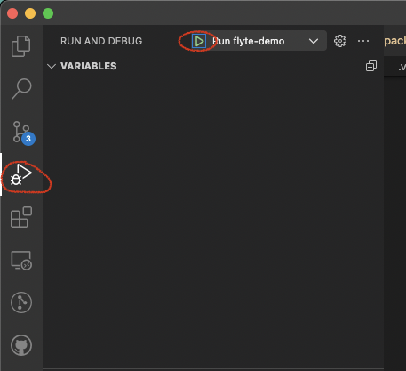

# Workspace VSCode Extension

This VSCode extension provides an onboarding experience for
Union Workspaces.

## Development Process

### Debugging extension:

Run the extension by pressing `F5` or by going to the debug side menu.
From here you can put breakpoints wherever you want:



### Generating binaries:

Install vsce (one time):

```bash
npm install -g vsce
```

Generate vsix binary:

```bash
vsce package --no-yarn
```

This will create a `union-workspace-X.Y.Z.vsix` file in the root directory.

### Generating a new release

- Add a `git tag -a vX.Y.Z` to the latest commit.
- Push the tag to the remote: `git push origin --follow-tags`.
- Go to the repo's new releases page: https://github.com/unionai/workspace-vscode-extension/releases/new.
- Create a new release with the same name as the tag `vX.Y.Z`.
- Attach the `union-workspace-X.Y.Z.vsix` file to the release.
